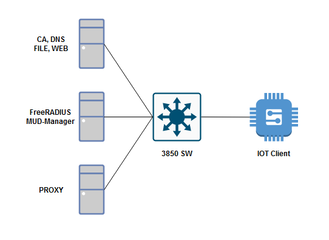

# safe-patching
Implementation of RFC 8520 Manufacturer Usage Descriptions (MUD) with Improvements.

#### What is MUD?
Manufacturer Usage Description (MUD) is an embedded software standard that allows IoT Device makers to advertise device specifications, such as the intended communication patterns for their device when it connects to the network. The network device (in this implementation, a Cisco 3850 SW), will use the MUD file specifications to create an access policy for the IOT device, which limits its communication functions to only what is intended.

MUD prevents unauthorised network access to and from IOT devices that are not intended by its maufacturer, increasing the cybersecurity of the network.

#### Implementation Architecture
This implementation consists of:
- 1 Cisco 3850 Switch 
- 4 Raspberry Pi as CA/DNS/FILE/WEB server, FreeRADIUS/MUD-Manager, Proxy server and IOT Client

<figure style="text-align: center"></figure>

#### Improvements beyond RFC 8520 MUD
- Proxy Server using VirusTotal API  
Checks Update Patch Files for Suspicious/Malicious code, and only saves if secure.
